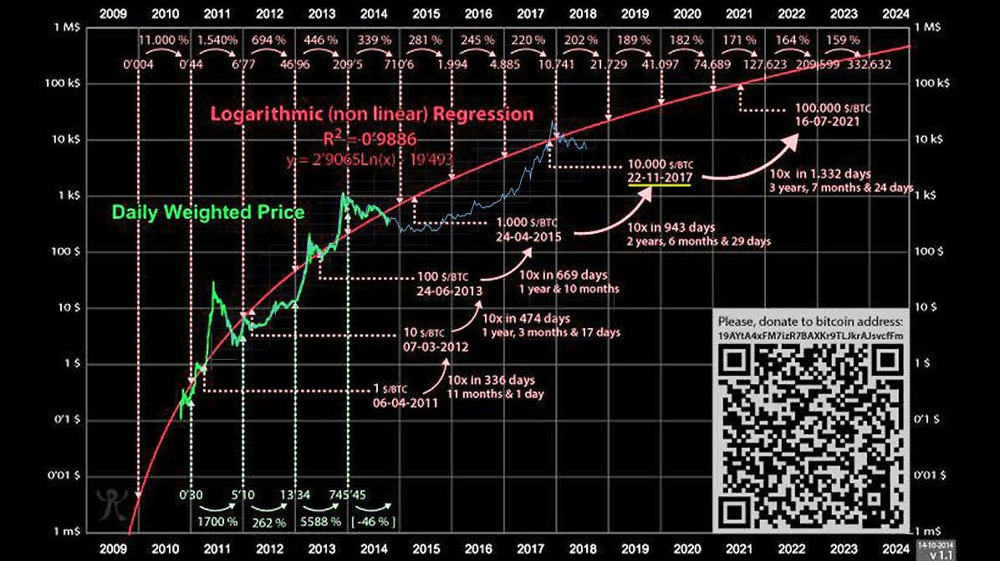

# Challenge: No general consensus yet

# Why sat needs its own symbol

http://www.unicode.org/versions/Unicode10.0.0/
BTC was added to unicode standard
List of all currency symbols in Unicode:
https://www.unicode.org/charts/PDF/U20A0.pdf

## Closed ecosystem is the ultimate goal

* Samourai removed USD denomination
* Lightning is coming, micro transactions will be a thing

**Building a habit early on for users to think in satoshis**

# Compatibility with other BIPs

BIP Jimmy Song Bits

# Examples for BTC prices

## BTC price forecast
calculate USD inflation and new money printed

It's reasonable to expect BTC to go up to 100k USD by 2022.

Log regression adoption price for BTC:
https://twitter.com/TuurDemeester/status/1029132554769760256

## Examples for micro transactions:

Use cases for sat denomination:

* Ingame transactions for items
* Content access (text, audio, video)
* Partial content access (e.g. pay per second of consumption)
* Coffee purchase
* Royalty and licensing collection/calculation

1 BTC = 100k USD:
* 0.01 USD = 10sat = 0.1 bits
* 0.19 USD = 190sat = 1.9 bits
* 0.39 USD = 390sat = 3.9 bits
* 0.99 USD = 990sat = 9.9 bits
* 4.99 USD = 4990sat 49.90 bits
* 9.99 USD = 9990sat = 99.90 bits

1 BTC = 1mio USD:

In this scenario 1 bit = 1 USD makes everything easier
* 0.01 USD = 1sat = 0.01 bits
* 0.19 USD = 19sat = 0.19 bits
* 0.39 USD = 39sat = 0.39 bits
* 0.99 USD = 99sat  = 0.99 bits
* 4.99 USD = 499sat = 4.99 bits
* 9.99 USD = 999sat = 9.99 bits

# Historical examples from other currencies and units 

// https://de.wikipedia.org/wiki/%C2%A5 includes currency symbols

Often a latin letter with a horizontal, vertical or 45° angle is used for currency denomination

* 1€ = 100 ¢
* $1 = 100 ¢
* 1¥ = 100 sen (did not have an intl symbol)
...

//todo: research history of denominations

# Existing Proposals

https://en.bitcoin.it/wiki/Satoshi_(unit)
Lists possible japanese symbols. Should be latin letter instaed for ww adoption

https://www.reddit.com/r/Bitcoin/comments/8xcy81/introducing_a_new_symbol_for_satoshi/
Coinranking proposal

# Currently existing S based characters and symbols

Unicode Characters:
///tbc

Unicode Symbols:
///tbc

# Requirements

* Internationally understood as a subunit to BTC
* latin character based
* no confusion with other unit symbols

# Proposel symbols

## 1. latin small letter s with dot above

| ṡ |
| - |
| latin small letter s with dot above |

Ṡ is used in Emilian-Romagnol to represent [z], e.g. faṡû [faˈzuː] "beans". It is used in Tunisian Arabic transliteration for /sˁ/ (based on Maltese with additional letters).

https://en.wikipedia.org/wiki/%E1%B9%A0

Does exist in unicode
Not really used for much in 

## 2. ...small s with 45° line through it

| //add image here |
| - |
| small s with 45° line through it |

Similar like cent ¢ cent sign, just an s instead of a c

Does not exist in unicode, hence could make its own distinctive symbol

# Possible issues with this proposal

## Many sub-units don't have a symbol and are used just fine:

Examples: 

1. Meter
2. gramm
3. Pascal
4. ...

## sat unit is not widely adopted and cannot be confused anyway

## a new artifically created symbol and enforced by a top-down approach (devs to users) is not in the "spirit" of bitcoin

It's hard to estimate if and how the btc ecosystem will be willing to use their resources

## no added value

Since the unit abbreviation 1sat is not really widely used for anything worldwide, a dedicated symbol might be unnecessary.

# Credits

All the credits go to Satoshi Nakamoto for the initial design of Bitcoin, to all Bitcoin developers, volunteers, supporters, users, miners, influencers, believers.

Special thanks to Jimmy Song whose [BIP 176](https://github.com/bitcoin/bips/blob/master/bip-0176.mediawiki) inspired me to propose this idea to the Bitcoin community.
